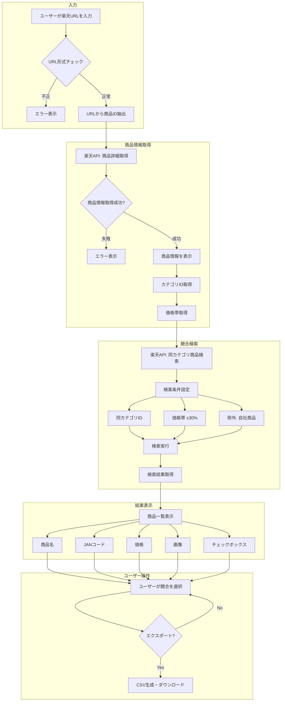
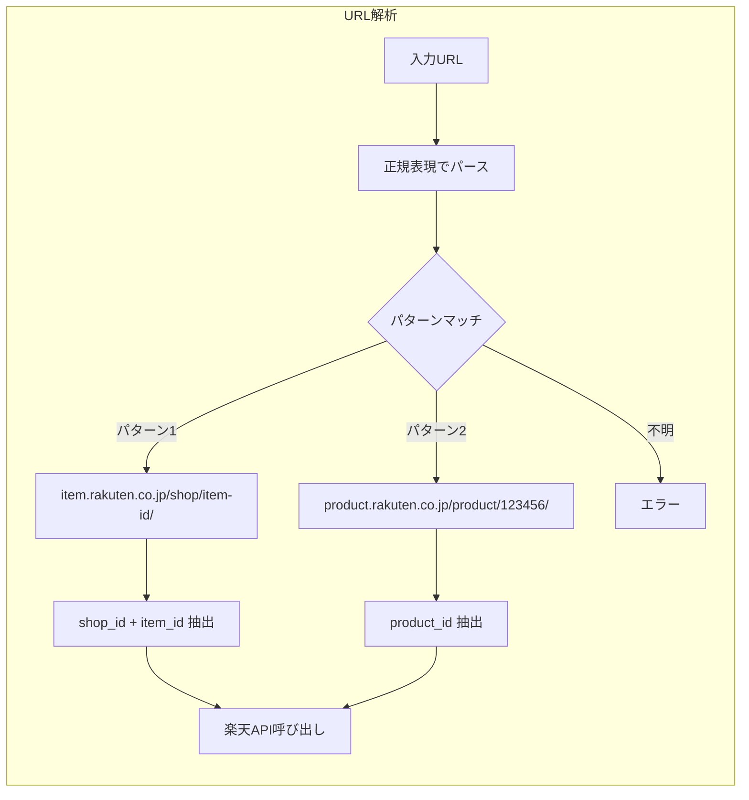
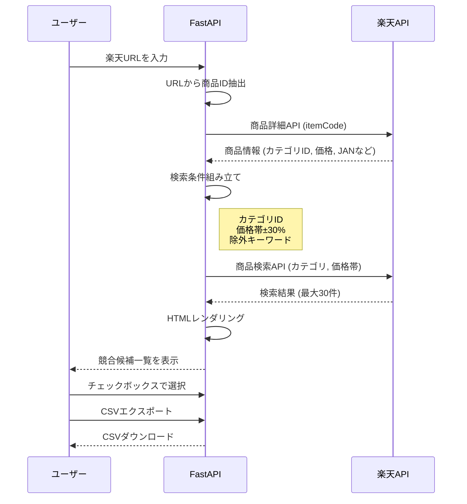
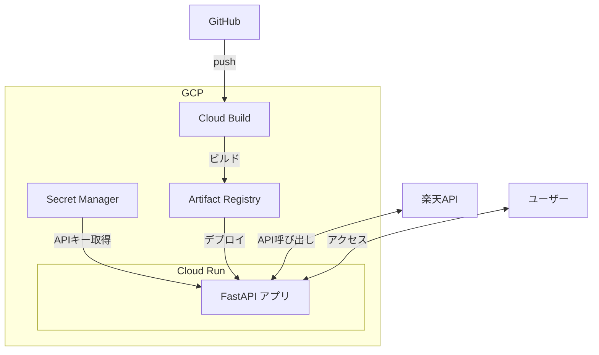

# 競合JANコード検索ツール 設計書

> 作成日: 2026-01-07  
> ステータス: 構想段階  
> コンセプト: **シンプルに作る。判定は人間がやる。**  
> 技術選定: **FastAPI + htmx**（Streamlit不採用）

---

## 背景・課題

### 現状の問題

- レビュー分析で競合データが不足
- 競合JANコードの指定をお願いしているが、要望が少ない
- 担当者が競合を調べるのが面倒

### 解決アプローチ

**複雑な自動判定はしない。検索して一覧表示するだけ。**

---

## ツール概要

```
【入力】自社商品の楽天URL
    ↓
【処理】URLから商品情報取得 → 同カテゴリ商品を検索
    ↓
【出力】競合候補一覧（JANコード付き）
    ↓
【ユーザー操作】目視で競合を選択
    ↓
【出力】CSVエクスポート
```

---

## 処理フロー（詳細）



---

## URL解析フロー



---

## 楽天API呼び出しフロー



---

## なぜ FastAPI + htmx なのか

### Streamlitを使わない理由

- 見た目が全部同じ（「またStreamlitか...」問題）
- カスタマイズができない
- 本番化できない（全部作り直しになる）

### FastAPI + htmx のメリット

- **Pythonだけで完結**（JavaScript学習不要）
- **セットアップがシンプル**（pip install 3つだけ）
- **1つのサーバーで完結**（CORS設定不要、デプロイ1回）
- **本番化への移行がスムーズ**（API設計が残る）
- **デザインのカスタマイズ自由**（Tailwind CSS使える）

---

## 機能要件

### 1. URL入力

| 項目      | 説明                            |
| ------- | ----------------------------- |
| 入力形式    | 楽天商品ページのURL                   |
| 対応パターン  | `item.rakuten.co.jp/xxx/yyy/` |
| バリデーション | URL形式チェック、楽天ドメインチェック          |


### 2. 自社商品情報表示

| 表示項目 | 説明 |
|---------|------|
| 商品名 | 入力したURLの商品名 |
| カテゴリ | 商品カテゴリ（検索に使用） |
| 価格 | 価格（価格帯検索に使用） |
| 画像 | 商品画像 |

### 3. 競合候補一覧

| 表示項目 | 説明 |
|---------|------|
| 商品名 | 商品名 |
| JANコード | JANコード（あれば） |
| メーカー | メーカー名/ショップ名 |
| 価格 | 参考価格 |
| 商品画像 | サムネイル |
| 商品URL | 楽天へのリンク |

### 4. 選択・エクスポート

- チェックボックスで競合候補を選択
- 選択した商品をCSVでエクスポート
- 出力項目: JANコード, 商品名, メーカー, 価格, URL

---

## 技術設計

### アーキテクチャ

```
┌─────────────────────────────┐
│   FastAPI                    │
│  ・HTMLレンダリング（Jinja2）   │
│  ・楽天API呼び出し             │
│  ・URL解析                    │
│  ・CSVエクスポート             │
└──────────────┬──────────────┘
               │
┌──────────────▼──────────────┐
│   ブラウザ                    │
│  ・htmx（非同期通信・部分更新）  │
│  ・Tailwind CSS（デザイン）    │
└─────────────────────────────┘
```

### 使用技術

| コンポーネント | 技術 |
|--------------|------|
| バックエンド | FastAPI |
| テンプレート | Jinja2 |
| 非同期通信 | htmx |
| デザイン | Tailwind CSS |
| API | 楽天商品検索API |
| 言語 | Python |

### セットアップ

```bash
pip install fastapi uvicorn jinja2 requests
```

---

## ローカル環境構築

### 1. プロジェクト作成

```bash
# ディレクトリ作成
mkdir jan-search
cd jan-search
```

### 2. venv環境構築

```bash
# venv作成
python -m venv venv

# 有効化（Windows）
venv\Scripts\activate

# 有効化（Mac/Linux/WSL）
source venv/bin/activate
```

### 3. パッケージインストール

```bash
# requirements.txt作成
cat << 'EOF' > requirements.txt
fastapi==0.109.0
uvicorn==0.27.0
jinja2==3.1.3
requests==2.31.0
python-multipart==0.0.6
EOF

# インストール
pip install -r requirements.txt
```

### 4. ディレクトリ構成作成

```bash
# ディレクトリ作成
mkdir templates

# ファイル作成（空ファイル）
touch main.py
touch rakuten.py
touch templates/base.html
touch templates/index.html
touch templates/results.html
```

### 5. 環境変数設定

```bash
# .envファイル作成
cat << 'EOF' > .env
RAKUTEN_APP_ID=your_app_id_here
EOF

# .gitignore作成
cat << 'EOF' > .gitignore
venv/
__pycache__/
.env
*.pyc
EOF
```

### 6. 楽天APIアプリID取得

1. https://webservice.rakuten.co.jp/ にアクセス
2. 楽天会員でログイン
3. 「アプリID発行」からアプリを登録
4. 発行されたアプリIDを `.env` に記載

### 7. ローカル起動

```bash
# 環境変数読み込み（WSL/Mac/Linux）
export $(cat .env | xargs)

# サーバー起動
uvicorn main:app --reload --host 0.0.0.0 --port 8000
```

ブラウザで http://localhost:8000 にアクセス

### 8. 開発時のコマンド

```bash
# venv有効化（毎回）
source venv/bin/activate  # Mac/Linux/WSL
venv\Scripts\activate      # Windows

# サーバー起動（ホットリロード有効）
uvicorn main:app --reload

# パッケージ追加時
pip install <package>
pip freeze > requirements.txt
```

---

## 画面イメージ

```
┌────────────────────────────────────────┐
│  競合JANコード検索ツール                  │
├────────────────────────────────────────┤
│                                        │
│  自社商品の楽天URLを入力:                 │
│  ┌──────────────────────────────────┐  │
│  │ https://item.rakuten.co.jp/...   │  │
│  └──────────────────────────────────┘  │
│  [検索]                                │
│                                        │
├────────────────────────────────────────┤
│  入力した商品:                          │
│  ┌────────────────────────────────┐   │
│  │ [画像] 自社 〇〇ごはん 200g×10   │   │
│  │ カテゴリ: 食品 > 米 > パックご飯  │   │
│  │ 価格: ¥1,280                   │   │
│  └────────────────────────────────┘   │
│                                        │
├────────────────────────────────────────┤
│  競合候補: 28件（同カテゴリ・価格帯±30%）  │
│                                        │
│  ┌────────────────────────────────┐   │
│  │ □ [画像] A社 〇〇ごはん 200g×10  │   │
│  │    JAN: 4901234567890           │   │
│  │    ¥1,380                       │   │
│  └────────────────────────────────┘   │
│                                        │
│  ┌────────────────────────────────┐   │
│  │ ☑ [画像] B社 △△パックライス     │   │
│  │    JAN: 4909876543210           │   │
│  │    ¥1,180                       │   │
│  └────────────────────────────────┘   │
│                                        │
├────────────────────────────────────────┤
│  選択中: 3件  [CSVエクスポート]          │
└────────────────────────────────────────┘
```

---

## 実装コード（イメージ）

### ディレクトリ構成

```
jan-search/
├── main.py              # FastAPIアプリ
├── rakuten.py           # 楽天API呼び出し
├── templates/
│   ├── base.html        # ベーステンプレート
│   ├── index.html       # メイン画面
│   ├── product.html     # 自社商品情報（部分）
│   └── results.html     # 検索結果（部分）
└── requirements.txt
```

### main.py

```python
from fastapi import FastAPI, Request, Form
from fastapi.responses import HTMLResponse, StreamingResponse
from fastapi.templating import Jinja2Templates
import re
import csv
import io
from rakuten import RakutenAPI

app = FastAPI()
templates = Jinja2Templates(directory="templates")
rakuten = RakutenAPI()

@app.get("/", response_class=HTMLResponse)
async def index(request: Request):
    return templates.TemplateResponse("index.html", {"request": request})

@app.post("/search", response_class=HTMLResponse)
async def search(request: Request, url: str = Form(...)):
    # 1. URLから商品ID抽出
    item_id = extract_item_id(url)
    if not item_id:
        return templates.TemplateResponse("error.html", {
            "request": request,
            "message": "URLが不正です"
        })
    
    # 2. 商品詳細取得
    product = rakuten.get_item(item_id)
    if not product:
        return templates.TemplateResponse("error.html", {
            "request": request,
            "message": "商品が見つかりません"
        })
    
    # 3. 同カテゴリ商品検索
    competitors = rakuten.search_competitors(
        category_id=product["categoryId"],
        price_min=int(product["price"] * 0.7),
        price_max=int(product["price"] * 1.3),
        exclude_shop=product["shopId"]
    )
    
    return templates.TemplateResponse("results.html", {
        "request": request,
        "product": product,
        "competitors": competitors
    })

def extract_item_id(url: str) -> str | None:
    """楽天URLから商品IDを抽出"""
    pattern = r"item\.rakuten\.co\.jp/([^/]+)/([^/]+)"
    match = re.search(pattern, url)
    if match:
        return f"{match.group(1)}:{match.group(2)}"
    return None

@app.post("/export")
async def export_csv(jan_codes: list[str] = Form(...)):
    output = io.StringIO()
    writer = csv.writer(output)
    writer.writerow(["JANコード", "商品名", "価格", "URL"])
    for jan in jan_codes:
        writer.writerow([jan, "", "", ""])  # 詳細は別途取得
    
    output.seek(0)
    return StreamingResponse(
        iter([output.getvalue()]),
        media_type="text/csv",
        headers={"Content-Disposition": "attachment; filename=competitors.csv"}
    )
```

### rakuten.py

```python
import requests

class RakutenAPI:
    def __init__(self):
        self.app_id = "your_app_id"
        self.base_url = "https://app.rakuten.co.jp/services/api"
    
    def get_item(self, item_code: str) -> dict | None:
        """商品詳細を取得"""
        url = f"{self.base_url}/IchibaItem/Search/20220601"
        params = {
            "applicationId": self.app_id,
            "itemCode": item_code
        }
        response = requests.get(url, params=params)
        items = response.json().get("Items", [])
        if items:
            item = items[0]["Item"]
            return {
                "name": item["itemName"],
                "price": item["itemPrice"],
                "categoryId": item["genreId"],
                "shopId": item["shopCode"],
                "image": item["mediumImageUrls"][0]["imageUrl"],
                "jan": item.get("itemCode", "")
            }
        return None
    
    def search_competitors(self, category_id: str, price_min: int, 
                          price_max: int, exclude_shop: str) -> list:
        """同カテゴリの競合商品を検索"""
        url = f"{self.base_url}/IchibaItem/Search/20220601"
        params = {
            "applicationId": self.app_id,
            "genreId": category_id,
            "minPrice": price_min,
            "maxPrice": price_max,
            "hits": 30
        }
        response = requests.get(url, params=params)
        items = response.json().get("Items", [])
        
        # 自社ショップを除外
        competitors = []
        for item in items:
            if item["Item"]["shopCode"] != exclude_shop:
                competitors.append({
                    "name": item["Item"]["itemName"],
                    "price": item["Item"]["itemPrice"],
                    "image": item["Item"]["mediumImageUrls"][0]["imageUrl"],
                    "jan": item["Item"].get("jan", ""),
                    "url": item["Item"]["itemUrl"],
                    "shop": item["Item"]["shopName"]
                })
        return competitors
```

---

## 開発スケジュール

| タスク | 時間 |
|-------|------|
| 環境準備 | 15分 |
| 楽天APIアプリID取得 | 10分 |
| URL解析ロジック実装 | 30分 |
| 楽天API呼び出し実装 | 1時間 |
| htmx + テンプレート実装 | 1時間 |
| デザイン調整（Tailwind） | 30分 |
| 動作確認 | 30分 |
| **合計** | **約4時間** |

---

## 制限事項・注意点

- 楽天APIなので楽天の商品のみ（Amazon等は対象外）
- JANコードがない商品もある
- API呼び出し制限あり（1秒1リクエスト程度）
- 楽天に出品していない競合は検索できない

---

## JANコードについて

JANコード（Japanese Article Number）は商品に付与される**固有の識別番号**。

```
同じ商品 = 同じJANコード
├── 楽天で売ってる → JAN: 4901234567890
├── Amazonで売ってる → JAN: 4901234567890
├── スーパーで売ってる → JAN: 4901234567890
└── 全部同じ番号
```

**このツールの価値**:
- 楽天で競合のJANコードを効率的に収集
- そのJANコードをレビュー分析に渡す
- **あとは既存システムで自動的に楽天・Amazonのレビューが紐づく**

---

## GCPデプロイ設計

### アーキテクチャ



### 使用サービス

| サービス | 用途 | 料金目安 |
|---------|------|---------|
| Cloud Run | アプリ実行 | ほぼ無料（低トラフィック時） |
| Secret Manager | 楽天APIキー保管 | ほぼ無料 |
| Artifact Registry | Dockerイメージ保管 | ほぼ無料 |
| Cloud Build | CI/CD | 無料枠あり |

### ディレクトリ構成

```
jan-search/
├── main.py
├── rakuten.py
├── templates/
│   ├── base.html
│   ├── index.html
│   └── results.html
├── Dockerfile
├── cloudbuild.yaml
├── requirements.txt
└── .env.example
```

### Dockerfile

```dockerfile
FROM python:3.11-slim

WORKDIR /app

COPY requirements.txt .
RUN pip install --no-cache-dir -r requirements.txt

COPY . .

CMD ["uvicorn", "main:app", "--host", "0.0.0.0", "--port", "8080"]
```

### cloudbuild.yaml

```yaml
steps:
  # Dockerイメージをビルド
  - name: 'gcr.io/cloud-builders/docker'
    args: ['build', '-t', 'asia-northeast1-docker.pkg.dev/$PROJECT_ID/jan-search/app:$COMMIT_SHA', '.']
  
  # Artifact Registryにプッシュ
  - name: 'gcr.io/cloud-builders/docker'
    args: ['push', 'asia-northeast1-docker.pkg.dev/$PROJECT_ID/jan-search/app:$COMMIT_SHA']
  
  # Cloud Runにデプロイ
  - name: 'gcr.io/google.com/cloudsdktool/cloud-sdk'
    entrypoint: gcloud
    args:
      - 'run'
      - 'deploy'
      - 'jan-search'
      - '--image'
      - 'asia-northeast1-docker.pkg.dev/$PROJECT_ID/jan-search/app:$COMMIT_SHA'
      - '--region'
      - 'asia-northeast1'
      - '--platform'
      - 'managed'
      - '--allow-unauthenticated'

images:
  - 'asia-northeast1-docker.pkg.dev/$PROJECT_ID/jan-search/app:$COMMIT_SHA'
```

### 環境変数設定

```bash
# Secret Managerに楽天APIキーを登録
gcloud secrets create rakuten-api-key --data-file=- <<< "your_api_key"

# Cloud Runに環境変数として設定
gcloud run services update jan-search \
  --set-secrets=RAKUTEN_APP_ID=rakuten-api-key:latest
```

### main.pyでの環境変数読み込み

```python
import os

RAKUTEN_APP_ID = os.environ.get("RAKUTEN_APP_ID")
```

### デプロイ手順

```bash
# 1. GCPプロジェクト設定
gcloud config set project your-project-id

# 2. APIを有効化
gcloud services enable run.googleapis.com
gcloud services enable cloudbuild.googleapis.com
gcloud services enable secretmanager.googleapis.com
gcloud services enable artifactregistry.googleapis.com

# 3. Artifact Registryリポジトリ作成
gcloud artifacts repositories create jan-search \
  --repository-format=docker \
  --location=asia-northeast1

# 4. Secret Manager設定
gcloud secrets create rakuten-api-key --data-file=- <<< "your_api_key"

# 5. Cloud Buildトリガー設定（GitHub連携）
# GCPコンソールから設定

# 6. 手動デプロイ（初回）
gcloud builds submit --config=cloudbuild.yaml
```

### アクセス制限（オプション）

社内限定にする場合：

```bash
# IAP（Identity-Aware Proxy）を有効化
gcloud run services update jan-search --no-allow-unauthenticated

# 特定ユーザーにアクセス権付与
gcloud run services add-iam-policy-binding jan-search \
  --member="user:user@example.com" \
  --role="roles/run.invoker"
```

---

## 今後の拡張（やるなら）

- [ ] Amazon PA-API対応（審査が必要）
- [ ] 検索履歴の保存
- [ ] レビュー分析への直接連携
- [ ] 選択した競合の保存機能
- [ ] 複数URL一括入力

---

## 関連ドキュメント

- [[2026-01-07 レビュー分析 説明会資料_原案]]
- [[2025-12-15 「FastAPI + htmxが最強説」- AIエンジニアがモック作るならReactは不要、Streamlitも捨てよう]]

